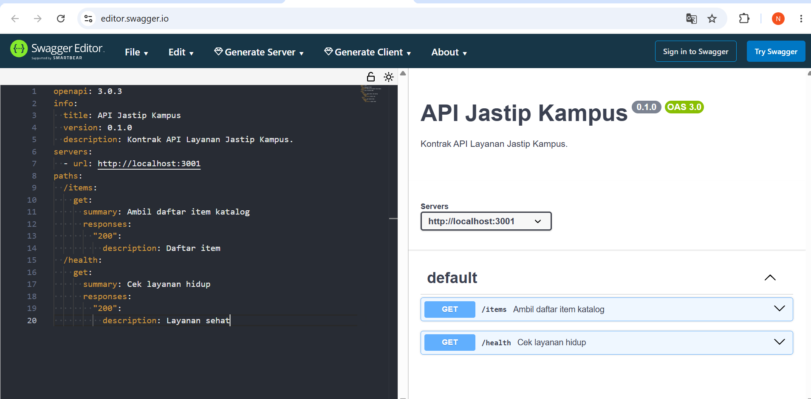

# AI Log � Kelompok 15 (Jastip Kampus)

Dokumen ini mencatat interaksi dengan AI / GitHub Copilot selama pengerjaan proyek.
#### Bukti Verifikasi Swagger Editor

### Arsitek Sistem � Pertemuan 1

#### Entri 1
- **Konteks**: Membuat layanan katalog Express pertama (`services/catalog/index.js`).
- **Prompt**: "Buat server Express dengan GET /items (data di memori) dan GET /health yang membalas status ok."
- **Diterima**: Struktur dasar server Express, konfigurasi port 3001, serta handler untuk endpoint GET `/items` dan `/health`.
- **Ditolak & alasan**: AI sempat menyarankan menambahkan dependensi koneksi database (MongoDB/Mongoose) dan fungsi CRUD lengkap. Saya **HAPUS/TOLAK** saran tersebut karena Pertemuan 1 fokus pada data di memori. Menambah database di tahap ini hanya menambah kompleksitas sebelum waktunya.
- **Verifikasi**: Pengujian via terminal `curl.exe -s http://localhost:3001/health` membalas `{"status":"ok","service":"catalog"}` dan `/items` mengembalikan daftar barang ? Berhasil & Sesuai.

#### Entri 2
- **Konteks**: Membuat spesifikasi OpenAPI/Swagger (`openapi.yaml`).
- **Prompt**: "Buat kerangka OpenAPI 3.0 untuk API Jastip Kampus dengan endpoint GET /items dan GET /health."
- **Diterima**: Format skema YAML dengan versi `openapi: 3.0.3`, info metadata, dan daftar path `/items` serta `/health`.
- **Ditolak & alasan**: AI memberikan contoh skema dengan `tab` untuk indentasi dan mencantumkan port default `8080`. Saya **UBAH** indentasi menjadi 2 spasi konsisten dan mengubah URL server ke `http://localhost:3001` agar sesuai dengan *port* `catalog-service`.
- **Verifikasi**: Divalidasi di `editor.swagger.io` tanpa ada pesan error merah ? Berhasil & Sesuai.
---

### Arsitek Sistem — Pertemuan 2

#### Entri 1
- **Konteks**: Merancang komunikasi antara `order-service` dan `catalog-service` untuk mengambil harga barang sebelum membuat pesanan.
- **Prompt**: "Buat `order-service` Express yang memanggil `catalog-service` lewat HTTP untuk mengambil data barang."
- **Diterima**: Copilot men-generate blok `fetch` ke `CATALOG_URL/items/:id` dengan `try/catch` dan pengecekan `r.status === 404`.
- **Ditolak & alasan**: Copilot mengusulkan menambah dependensi `axios`. Saya tolak karena Node.js 18+ sudah menyertakan `fetch` bawaan — menambah paket eksternal untuk fungsionalitas yang sudah tersedia adalah overhead yang tidak perlu dan memperbesar attack surface dependensi.
- **Verifikasi**: `curl -X POST http://localhost:3002/orders -d '{"itemId":99,"qty":1}'` membalas `404 item tidak ada` — order-service berhasil meneruskan status dari catalog-service.

#### Entri 2
- **Konteks**: Memilih strategi penyimpanan data untuk `catalog-service` agar data persisten tanpa menambah infrastruktur baru.
- **Prompt**: "Tambahkan database ke catalog-service agar data items tersimpan di disk, bukan di memori."
- **Diterima**: Copilot menyarankan `node:sqlite` (built-in Node.js 22+) dengan `DatabaseSync`, alih-alih dependensi pihak ketiga seperti `better-sqlite3`.
- **Ditolak & alasan**: Copilot menyisipkan `db.close()` di dalam setiap handler request. Saya hapus karena `DatabaseSync` dirancang dibuka **sekali** saat startup dan dipakai sepanjang siklus hidup proses — menutup dan membuka kembali per-request menambah latensi dan rawan race condition pada koneksi itu sendiri.
- **Verifikasi**: Restart `catalog-service` → data tidak hilang; tabel dan isian awal tetap ada di `catalog.db`.

---

### Data & Persistence Engineer — Pertemuan 2

#### Entri 1
- **Konteks**: Mendefinisikan skema tabel `items` dan mengisi data awal hanya sekali saat database masih kosong.
- **Prompt**: "Buat tabel SQLite `items` dengan kolom id, nama, harga, sisa, lalu isi data awal hanya jika tabel masih kosong."
- **Diterima**: Copilot men-generate `CREATE TABLE IF NOT EXISTS` dan guard `SELECT COUNT(*) AS n ... if (jumlah === 0)` sebelum INSERT.
- **Ditolak & alasan**: Copilot mengusulkan seeding dengan `INSERT OR IGNORE` tanpa kolom `sisa`. Saya tolak karena `sisa` adalah sumber kebenaran tunggal untuk kuota jastip — menghilangkannya berarti endpoint `/ambil` tidak punya data untuk dikurangi. Selain itu, `INSERT OR IGNORE` menyembunyikan kegagalan secara diam-diam, berbeda dengan guard `COUNT(*)` yang transparan dan mudah di-debug.
- **Verifikasi**: `SELECT * FROM items` pada `catalog.db` setelah restart memperlihatkan dua baris lengkap dengan kolom `sisa` berisi 50 dan 100.

#### Entri 2
- **Konteks**: Membuat endpoint mengurangi stok yang aman saat ramai (`POST /items/:id/ambil`).
- **Prompt**: "Buat endpoint Express yang mengurangi kolom `sisa` pada tabel `items` di `node:sqlite`, aman dari race condition."
- **Diterima**: Copilot menyarankan `SELECT sisa FROM items WHERE id = ?` dulu, cek di JavaScript `if (item.sisa > 0)`, baru `UPDATE items SET sisa = sisa - 1 WHERE id = ?`.
- **Ditolak & alasan**: Pola baca-lalu-tulis itu BISA kesalip — dua request masuk hampir bersamaan sama-sama membaca `sisa = 1`, keduanya lolos kondisi JS, lalu keduanya menjalankan UPDATE. Hasilnya `sisa` menjadi `−1`. Saya ganti menjadi satu perintah `UPDATE items SET sisa = sisa - 1 WHERE id = ? AND sisa > 0` dan mengandalkan `hasil.changes === 0` untuk deteksi stok habis — SQLite sendiri yang menjamin atomisitas, bukan kode JavaScript.
- **Verifikasi**: Uji 3 request paralel pada item dengan `sisa = 2` → `201`, `201`, `409`. Benar menolak request ketiga tanpa membuat stok minus.

---

### Backend Developer — Pertemuan 2

#### Entri 1
- **Konteks**: Menambahkan validasi input di `POST /orders` agar request dengan tipe data salah ditolak lebih awal.
- **Prompt**: "Tambahkan validasi input di POST /orders agar itemId dan qty harus berupa bilangan bulat positif."
- **Diterima**: Copilot men-generate guard `if (!Number.isInteger(itemId) || !Number.isInteger(qty) || qty < 1)`.
- **Ditolak & alasan**: Copilot awalnya menggunakan `typeof itemId !== 'number'` yang masih meloloskan nilai float seperti `1.5`. `Number.isInteger` lebih ketat — float dan NaN ditolak, sesuai dengan kebutuhan ID dan kuantitas yang harus berupa bilangan bulat.
- **Verifikasi**: `curl -d '{"itemId":1,"qty":0.5}'` → `400 itemId dan qty wajib angka, qty minimal 1`. Float berhasil ditolak.

#### Entri 2
- **Konteks**: Menerbitkan event `order.created` ke Redis setelah pesanan berhasil dibuat.
- **Prompt**: "Setelah order berhasil dibuat, terbitkan event ke Redis channel `order.created`."
- **Diterima**: Copilot men-generate `pub.publish("order.created", JSON.stringify(order))` dengan Redis `createClient`.
- **Ditolak & alasan**: Copilot menempatkan `pub.connect()` **di dalam** handler request, sehingga koneksi baru dibuka setiap kali ada order. Saya pindahkan inisialisasi ke level modul (satu kali saat startup) agar tidak terjadi connection leak dan tidak menambah latensi per-request.
- **Verifikasi**: Log `notification-service` mencetak baris notifikasi untuk setiap `POST /orders` yang berhasil, tanpa ada pesan error koneksi baru berulang.

---

### Integration Engineer — Pertemuan 2

#### Entri 1
- **Konteks**: Membuat `notification-service` yang mendengarkan event `order.created` dari Redis dan mencetak notifikasi.
- **Prompt**: "Buat subscriber Redis yang mendengarkan channel `order.created` dan mencetak isi pesan ke konsol."
- **Diterima**: Copilot men-generate `sub.subscribe("order.created", (msg) => { const order = JSON.parse(msg); ... })` dalam IIFE async.
- **Ditolak & alasan**: Copilot memanggil `JSON.parse(msg)` langsung tanpa proteksi. Jika ada publisher nakal yang mengirim string bukan-JSON, seluruh proses subscriber crash dan semua notifikasi selanjutnya tidak terproses. Saya wrap dengan `try/catch` di dalam callback dan log pesan yang gagal di-parse tanpa menghentikan proses.
- **Verifikasi**: Kirim pesan `"bukan-json"` langsung ke channel Redis → subscriber mencetak peringatan parse error dan tetap berjalan menerima event berikutnya.

---

### QA, Load-Test & Dokumentasi · Lapisan 1 · Entri 1
- **Konteks**: Menulis smoke test terminal dengan `node --test` untuk jalur kritis `order-service` sesuai `openapi.yaml`.
- **Prompt**: "Tulis smoke test Node bawaan untuk endpoint `GET /health` dan `POST /orders` yang memverifikasi 201 untuk request sah, 400 untuk input salah, dan 404 untuk item yang tidak ada."
- **Diterima**: Struktur `node:test` dengan `fetch`, `assert.equal`, dan payload yang mengikuti kontrak aktual `{ itemId, qty }`.
- **Ditolak & alasan**: Saran contoh generik memakai body `{ productId, qty, buyer }` saya tolak karena tidak cocok dengan spesifikasi repo ini. Kalau dipakai mentah-mentah, test akan gagal palsu dan tidak lagi menguji API yang sebenarnya.
- **Verifikasi**: `npm run test:services` menghasilkan `tests 5`, `pass 5`, `fail 0`.

### QA, Load-Test & Dokumentasi · Lapisan 2 · Entri 2
- **Konteks**: Menulis uji rebutan yang membuktikan stok tidak oversell saat `POST /orders` ditembak serentak.
- **Prompt**: "Buat uji `node:test` yang menembakkan ratusan request paralel ke `POST /orders`, lalu periksa jumlah sukses, jumlah 409, dan sisa stok akhir."
- **Diterima**: Pola `Promise.all` untuk menembak request bersamaan, lalu asersi `sukses <= stokAwal`, `sisa >= 0`, dan `sukses + ditolak === jumlahPenyerbu`.
- **Ditolak & alasan**: Saya tolak pola uji yang menganggap `409` sebagai kegagalan. Pada sistem rebutan, `409 stok habis` adalah perilaku benar; yang gagal justru jika ada `5xx`, stok minus, atau sukses melebihi stok awal.
- **Verifikasi**: Run terminal mencetak `stokAwal=50 sukses=50 ditolak=150 sisa=0`, lalu test lulus.

### QA, Load-Test & Dokumentasi · Lapisan 3 · Entri 3
- **Konteks**: Menyusun `LAPORAN.md` dan ringkasan hasil load test dari artefak JSON yang benar-benar diukur.
- **Prompt**: "Susun laporan tiga lapisan dari hasil smoke test, load test, dan dokumentasi arsitektur yang sudah ada."
- **Diterima**: Kerangka laporan terpadu, daftar perintah terminal yang bisa diulang, dan ringkasan angka dari `artifacts/loadtest/latest.json`.
- **Ditolak & alasan**: Saya tolak mengisi angka baseline sebelum perubahan yang tidak terekam dengan perintah identik. Menebak baseline akan membuat laporan terlihat penuh tetapi tidak jujur; lebih baik menandai gap pengukuran secara eksplisit.
- **Verifikasi**: Angka pada laporan dicocokkan langsung terhadap file artefak JSON dan output test runner terminal.