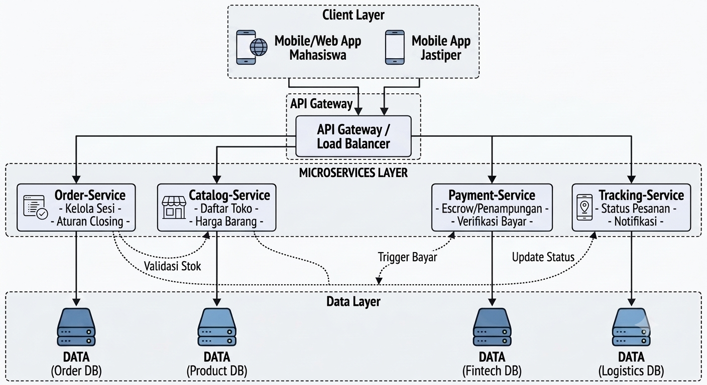

# Context Map: Jastip Kampus

Diagram sederhana komunikasi antar layanan:

[order-service] ----> [catalog-service]
(Meminta data harga acuan toko)
       |
       +--------> [payment-service]
       (Meneruskan instruksi tahan/lepas dana)
       |
       +--------> [tracking-service]
       (Memperbarui status barang yang dititip)
## Ringkasan Proyek
Sistem ini dirancang untuk proses pemesanan Jasa Titip (Jastip) makanan dan barang di lingkungan area kampus dengan kapasitas jastiper (runner) dan stok kantin/toko yang terbatas.

Tantangan utama:
- permintaan tinggi saat jam istirahat kuliah/jam makan siang,
- konflik alokasi jastiper untuk pesanan di slot waktu yang sama,
- pembatalan mendadak/no-show dari pembeli yang membuat jastiper rugi,
- tagihan harus akurat berdasarkan harga barang aktual dan komisi/ongkir jastip.

Tujuan sistem:
- mencegah order overlap pada jastiper yang sama,
- menjaga fairness antrean penugasan jastiper,
- melepas alokasi pesanan secara otomatis saat pembeli no-show/batal,
- menghasilkan billing yang akurat dari transaksi jastip.

## Scope Fitur
In scope:
- manajemen daftar kantin/toko, katalog barang, tarif komisi jastip, dan lokasi gedung,
- pemesanan jastip pada slot waktu/jadwal pengantaran tertentu,
- waitlist antrean pesanan saat seluruh jastiper penuh (busy),
- auto-release/batal otomatis untuk pesanan no-show (tidak dibayar/di-check-in),
- pencatatan sesi pengantaran (tracking status pesanan),
- perhitungan invoice (harga barang + ongkir) dan pembayaran.

Out of scope (saat ini):
- dynamic pricing komisi jastip berbasis demand real-time,
- integrasi kupon/promo loyalty antar fakultas,
- pengiriman eksternal di luar area kampus (hanya area internal kampus).

## Arsitektur yang Dipilih
Pendekatan yang digunakan adalah microservices per domain, dengan database terpisah per service (database-per-service) dan integrasi event-driven via Apache Kafka.

Komponen utama:
- catalog-service: kelola toko/kantin, menu barang, lokasi gedung, dan tarif jastip.
- order-service: kelola pemesanan jastip, validasi bentrok jadwal jastiper, waitlist, dan auto-release pesanan.
- tracking-service: kelola sesi pengantaran jastip (start/penjemputan, update lokasi/status, finish/diterima).
- billing-service: hitung invoice dari harga barang + komisi dan proses pembayaran.

Prinsip desain:
- no shared database antar service,
- konsistensi kuat di order-service untuk anti-overlap penugasan jastiper,
- eventual consistency antar service melalui event bus (Kafka),
- idempotency untuk API kritikal dan consumer event.

## Service dan Tanggung Jawab

### station-service
- master data kantin, toko, dan lokasi gedung kampus,
- data barang/menu makanan dan status ketersediaan,
- data tarif komisi/ongkir jastip antar gedung yang berlaku.

Entitas utama:
- Store(id, name, facultyLocation, status)
- CatalogItem(id, storeId, name, price, isAvailable)
- Tariff(id, originBuilding, destinationBuilding, deliveryFee, validFrom)
### booking-service
- create order jastip,
- validasi bentrok jadwal & kapasitas jastiper,
- proses waitlist FIFO pesanan,
- auto-release pesanan no-show.

Entitas utama:
- Order(id, buyerId, jastiperId, storeId, deliveryBuilding, scheduledTime, status)
- Waitlist(id, storeId, requestedTime, queueNumber, status)

### session-service
- mulai sesi pengantaran jastip,
- update status lokasi/posisi jastiper,
- selesai pengantaran.

Entitas utama:
- DeliverySession(id, orderId, jastiperId, startedAt, endedAt, currentStatus, notes)

### billing-service
- hitung invoice dari pemakaian jasa (harga barang + ongkir),
- proses pembayaran (QRIS/E-Wallet),
- simpan histori invoice dan payment.

Entitas utama:
- Invoice(id, orderId, itemSubtotal, deliveryFee, tax, totalAmount, status)
- Payment(id, invoiceId, method, amount, status, paidAt)
## Alur Bisnis Inti
1. User (Pembeli) membuat order jastip makanan/barang pada jadwal tertentu.
2. order-service mengecek ketersediaan jastiper dan stok toko.
3. Jika jastiper tersedia, order dikonfirmasi; jika penuh, pesanan masuk waitlist.
4. User melakukan pembayaran/check-in lalu sesi pengantaran dimulai di tracking-service.
5. Saat pengantaran selesai, status final dipublish.
6. billing-service mengonfirmasi invoice final dan merilis pembayaran ke jastiper.

## State Booking
- REQUESTED
- CONFIRMED
- WAITLISTED
- IN_DELIVERY
- COMPLETED
- EXPIRED_NO_SHOW
- CANCELLED

Transisi penting:
- REQUESTED ke CONFIRMED jika jastiper/slot tersedia,
- REQUESTED ke WAITLISTED jika jastiper penuh,
- WAITLISTED ke CONFIRMED saat dipromosikan dari antrean,
- CONFIRMED ke EXPIRED_NO_SHOW jika pembeli lewat grace period pembayaran/konfirmasi,
- CONFIRMED ke IN_DELIVERY saat jastiper mengambil barang dan mulai mengantar.

## Mekanisme Saat Jam Sibuk
- Anti-overlap order ditegakkan di level transaksi database order-service.
- Request yang tidak mendapat jastiper masuk antrean FIFO (waitlist).
- Pesanan yang no-show/tidak dibayar setelah grace period akan otomatis expired.
- Slot jastiper hasil auto-release langsung dipakai untuk promosi antrean berikutnya.

Implementasi anti-overlap (direkomendasikan PostgreSQL):
- gunakan transaksi dengan isolation level kuat,
- gunakan constraint interval waktu penugasan jastiper agar tidak overlap,
- tambahkan idempotency key untuk endpoint create order.

## Konsistensi dan Reliabilitas
- Outbox pattern untuk publish event yang andal.
- Consumer event idempotent berbasis event ID/version.
- Correlation ID untuk tracing lintas service.
- Audit log untuk perubahan status order, tracking, invoice, dan payment.

Event domain utama:
- OrderConfirmed
- OrderExpiredNoShow
- DeliveryStarted
- DeliveryFinished
- InvoiceCreated
- PaymentCompleted

## API Ringkas yang Disarankan

catalog-service:
- GET /stores
- GET /stores/{id}/items
- GET /tariffs/calculate?origin=&destination=

order-service:
- POST /orders
- POST /orders/{id}/check-in
- POST /orders/{id}/cancel
- GET /stores/{id}/availability?time=

session-service:
- POST /deliveries/start
- POST /deliveries/{id}/status
- POST /deliveries/{id}/finish

billing-service:
- GET /invoices/{id}
- POST /payments

## Kebutuhan Non-Fungsional
- Skalabilitas: service dapat scale horizontal secara independen saat jam makan siang.
- Ketersediaan: event processing tahan retry dan tidak kehilangan data transaksi.
- Keamanan: autentikasi JWT/OAuth2, mTLS antar service internal.
- Observability: metrics, logs, traces end-to-end.
- Auditability: perubahan status pesanan & pembayaran wajib tercatat.

### Preview Arsitektur

### Preview Sequence

## Dokumen Detail
- Detail arsitektur lengkap: [docs/ARSITEKTUR.md](docs/ARSITEKTUR.md)

## Asumsi Operasional
- Semua waktu transaksi & jadwal pengantaran disimpan dalam UTC.
- Grace period pembatalan otomatis (no-show) ditetapkan 10-15 menit dari pembuatan order.
- Promosi waitlist mengikuti urutan FIFO berdasarkan timestamp pesanan.
- Tarif komisi jastip yang dipakai billing adalah tarif aktif saat transaksi dikonfirmasi.